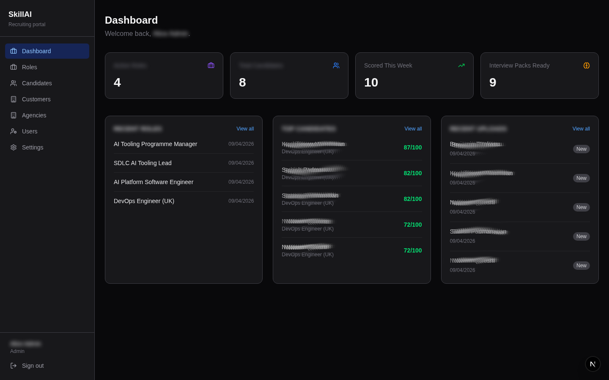
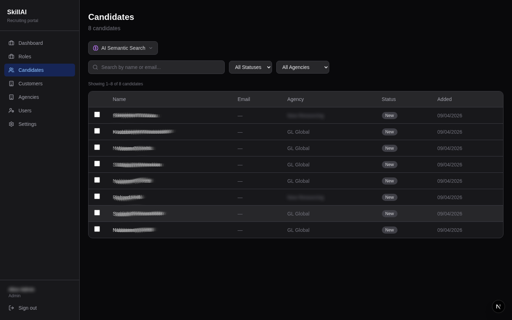
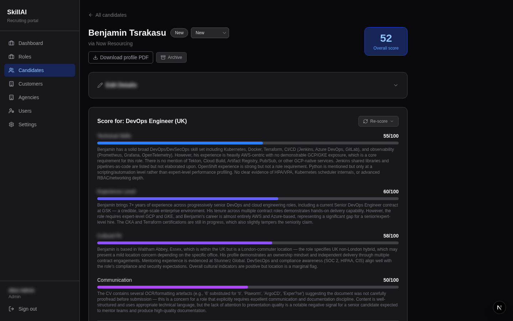
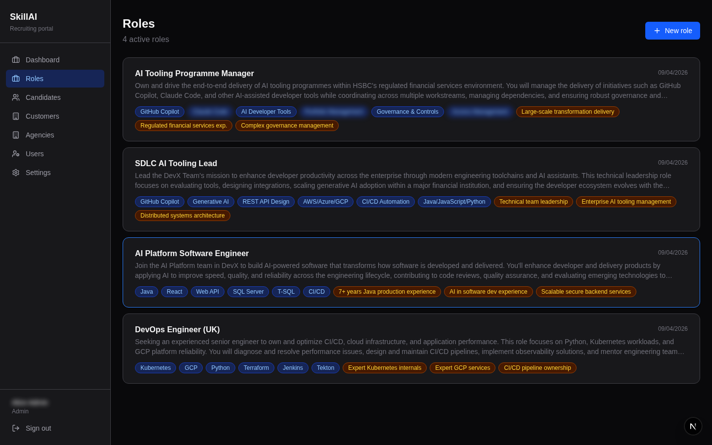
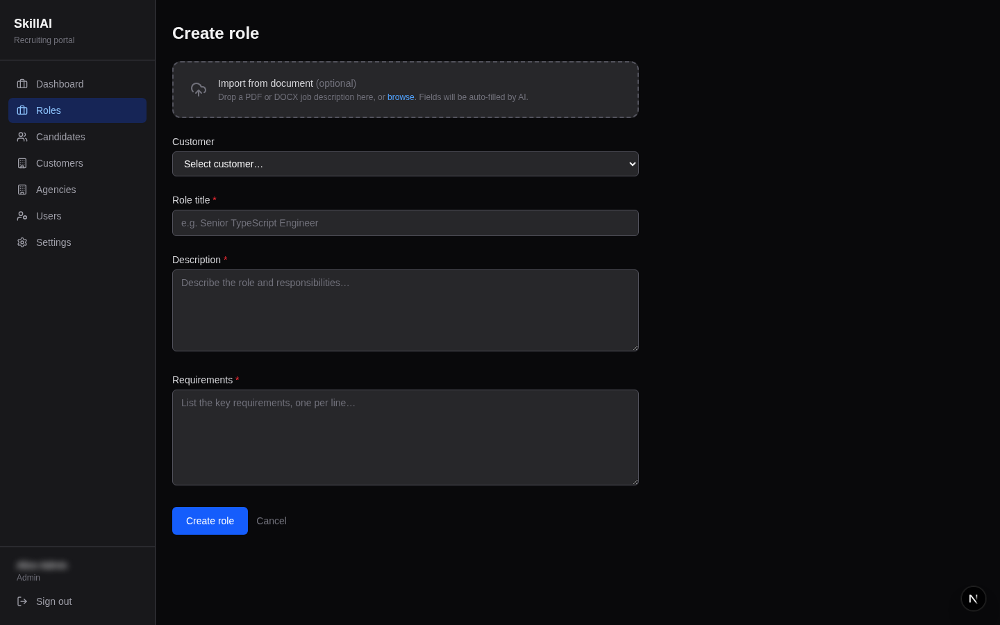
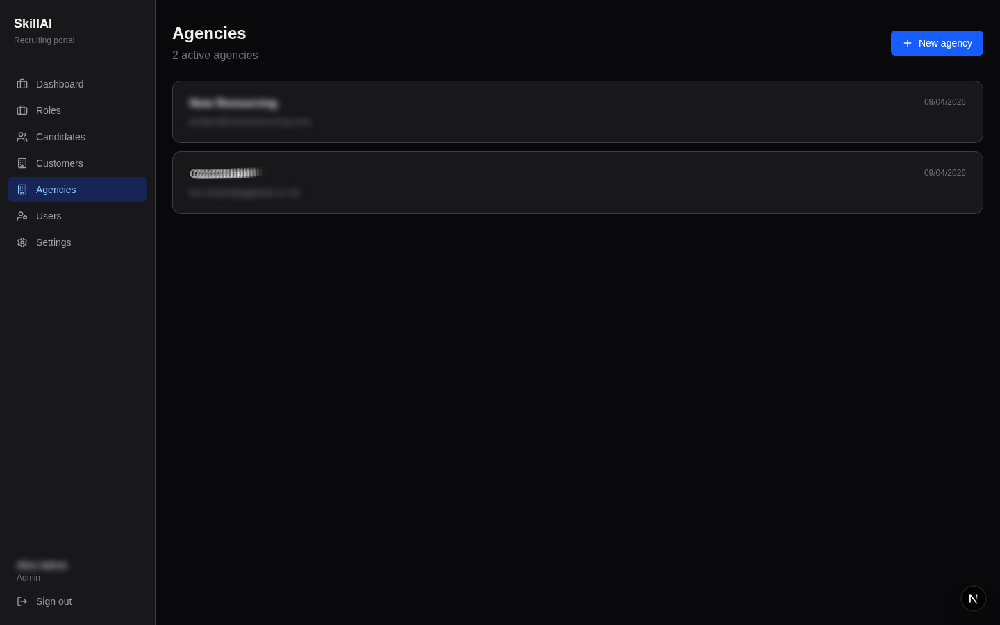
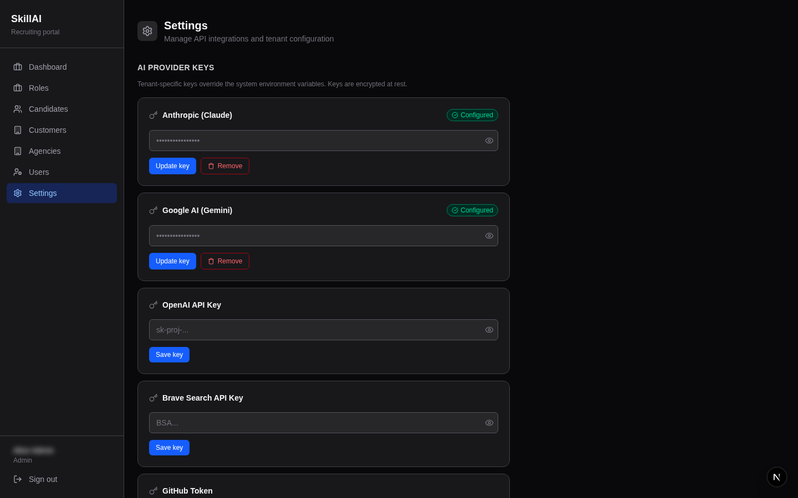
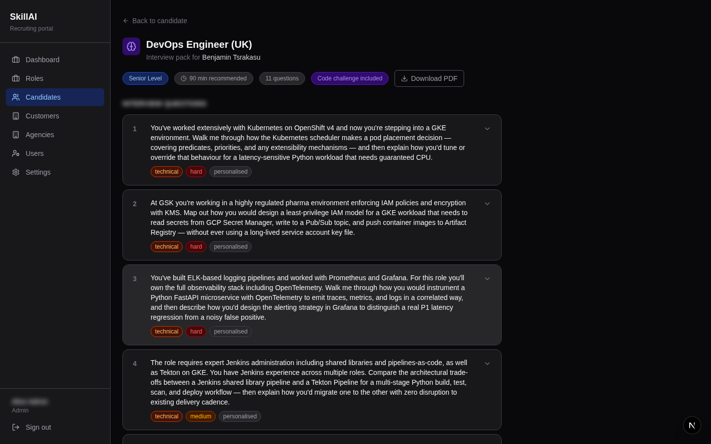

# SkillAI

An open-source, self-hosted AI-powered recruiting portal that helps teams rank, compare, and archive candidates against job roles using Claude and Gemini as the underlying models.

Licensed under the GNU General Public License v3.0.

---

## Vision

Recruiting teams drown in CV volume. A typical open role attracts 50 to 200 applications, each requiring manual reading, inconsistent scoring, and no searchable history when the role closes. Tools like Greenhouse, Lever, and Workday solve workflow problems but do not solve the core ranking problem, and they cost tens of thousands of pounds per year while sending sensitive candidate data to third-party infrastructure.

SkillAI takes a narrower, sharper position: make ranking fast, explainable, and reusable, on infrastructure you control.

The goal is not to replace an ATS. The goal is to give any recruiter or hiring manager a ten-second answer to the question "who are the best candidates for this role and why?" while keeping every CV, score, and note entirely within the team's own systems.

---

## What It Does

- Accepts CV uploads in PDF, DOCX, ODT, TXT, and RTF formats
- Parses and stores CV text with structured formatting
- Scores candidates against role descriptions across four dimensions: technical skills, experience level, cultural fit, and communication
- Generates personalised interview question packs with scoring rubrics, follow-up questions, and optional code challenges
- Archives all candidates with scoring history so past candidates can be re-evaluated against future roles
- Provides semantic search across the candidate archive using vector embeddings
- Tracks recruitment agencies and their candidate submissions
- Supports multiple users per tenant with role-based access (admin, recruiter, viewer)
- Extracts skill and requirement tags from role descriptions for fast visual comparison
- Exports candidate profiles, shortlists, and interview packs as PDFs
- Supports Google Calendar and Microsoft Calendar integration for interview scheduling

---

## Screenshots

### Dashboard



### Candidate List



### Candidate Profile



### CV Display


### Roles List



### Role Detail



### Agency Management



### Settings



### Interview Pack



---

## Technology Stack

| Layer | Technology |
|---|---|
| Framework | Next.js 15 (App Router, React 19) |
| Language | TypeScript 5 |
| Database | PostgreSQL 17 with pgvector |
| ORM | Drizzle ORM |
| Authentication | Auth.js v5 (credentials, JWT, RBAC) |
| Primary AI | Anthropic Claude claude-sonnet-4-6 |
| Secondary AI | Google Gemini gemini-2.0-flash |
| Embeddings | Google Gemini text-embedding-001 |
| Styling | TailwindCSS 4 |
| Icons | Lucide React |
| Deployment | Docker Compose |

---

## Documentation

- [Setup Guide](docs/setup.md)
- [Architecture](docs/architecture.md)
- [Development Guide](docs/development.md)
- [Roadmap](docs/roadmap.md)

---

## Quick Start

```bash
git clone https://github.com/olafkfreund/SkillAi.git
cd SkillAi
cp .env.example .env.local
# Edit .env.local with your API keys
docker compose up -d db
npm install
npm run db:push
npm run db:seed
npm run dev
```

Open http://localhost:3000 and sign in with the seeded admin credentials printed in the terminal.

Full setup instructions are in [docs/setup.md](docs/setup.md).

---

## License

SkillAI is free software: you can redistribute it and/or modify it under the terms of the GNU General Public License as published by the Free Software Foundation, either version 3 of the License, or (at your option) any later version.

See the [LICENSE](LICENSE) file for the full text.
