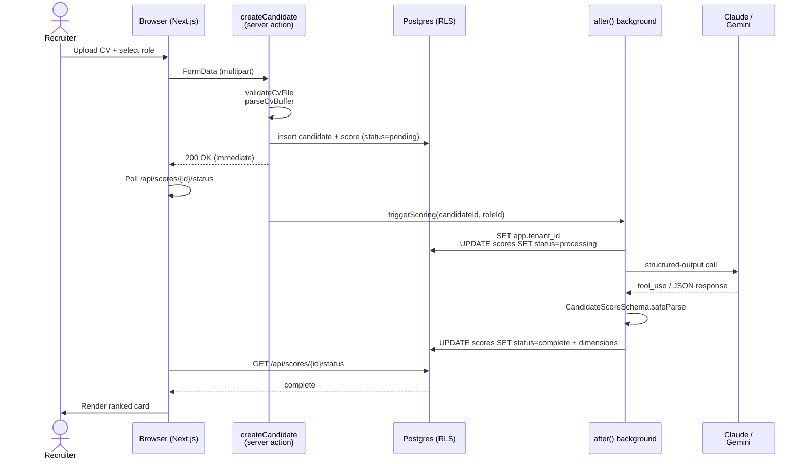
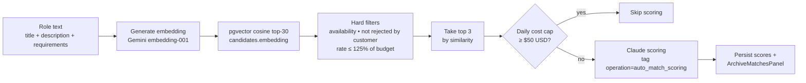

import { Aside } from '@astrojs/starlight/components'

When a candidate is uploaded and scored against a role, SkillAI takes a CV through parsing, AI scoring with a structured-output schema, persistence, and presentation. The whole flow is built around one invariant: **AI responses are always validated against a Zod schema before they hit the database.** Never parse unstructured text for fields that need to be stored.

## End-to-end flow



## Stage 1 — CV parsing

The recruiter uploads a CV via a Server Action. Validation and parsing both live in `src/lib/cv/store.ts`:

- **`validateCvFile()`** — checks size (≤10 MB), MIME type, and runs magic-byte detection via the `file-type` package to reject renamed binaries. Supported formats: PDF, DOCX, ODT, RTF, TXT, MD.
- **`parseCvBuffer()`** — extracts plain text using `pdf-parse` (PDF), `mammoth` (DOCX), or the appropriate parser for other formats. Strips null bytes and non-printable control characters that PostgreSQL rejects.
- **`persistCvFile()`** — writes the buffer to `/uploads/{tenantId}/{uuid}.{ext}`. The DB-relative path is computed first, then the absolute filesystem path is derived from it — guaranteeing write and read sides agree. See [File storage](/SkillAi/architecture/file-storage) for the symmetry rule.

The parsed text lands in `candidates.cv_text` and a `scores` row is inserted with `score_status = 'pending'`.

## Stage 2 — Background scoring with `after()`

The Server Action returns immediately so the UI doesn't block on the AI call. A Next.js `after()` callback then runs the actual scoring via `triggerScoring()` in `src/lib/ai/scoring.ts:26`:

1. Mark the `scores` row as `processing`.
2. Fetch the candidate + role + (if applicable) customer hiring framework.
3. Resolve the tenant's AI model preference from `tenant_settings.default_ai_model` — Claude unless explicitly set to `gemini`.
4. Build the soft budget context (see [below](#the-soft-budget-signal)).
5. Call `scoreCandidateWithClaude()` or `scoreCandidateWithGemini()`.
6. Validate the response against `CandidateScoreSchema`.
7. Write the four dimension scores + reasoning + summary back to the `scores` row, set `status = 'complete'`.
8. Fire-and-forget: notify Slack/Teams if the score crosses the tenant's high-score threshold; emit a `score.completed` audit row.

Errors anywhere in this chain land as `score_status = 'failed'` with the error message in `error_message`. A `score.failed` audit row records the failure with the role ID and the error.

## Stage 3 — The structured-output schema

Both providers return the same shape, validated by `CandidateScoreSchema` in `src/lib/ai/schema.ts`:

```typescript
export const CandidateScoreSchema = z.object({
  overall_score: z.number().int().min(0).max(100),
  dimensions: z.object({
    technical_skills: DimensionSchema,
    experience_level: DimensionSchema,
    cultural_fit: DimensionSchema,
    communication: DimensionSchema,
  }),
  summary: z.string().default('No summary provided'),
})
```

Where each dimension is `{ score: 0-100, reasoning: string }`.

**Claude** uses tool-use with a `submit_candidate_score` tool definition (see `src/lib/ai/claude.ts:18`). The tool's `input_schema` matches the Zod schema field-for-field. `tool_choice: { type: 'any' }` forces Claude to emit a tool call rather than free text.

**Gemini** uses `responseSchema` JSON mode (see `src/lib/ai/gemini.ts:19`). Same shape, different encoding — the `SCORE_RESPONSE_SCHEMA` constant is the equivalent of Claude's tool schema in Gemini's `Schema` type.

Both clients are configured with retries and timeouts (`maxRetries: 3`, `timeout: 120_000` on the Claude SDK; Gemini's retry behaviour ships in the SDK). A failure to validate against the Zod schema is treated as an error — no defensive coercion, no "try to parse it anyway."

## Stage 4 — Polling and rendering

The browser polls `/api/scores/{id}/status` every three seconds via TanStack Query. When the status flips to `complete`, the UI invalidates the role detail query and re-renders the ranked candidate cards. The four dimension scores are shown as horizontal bars; the AI reasoning is in an expandable section under each dimension.

## Auto-match — the orchestrator

Auto-match is a separate pipeline triggered when a recruiter creates or updates a role. It surfaces the top candidates from the archive without manually scoring all of them. The pipeline lives in `src/lib/auto-match/`:



Key constants (in `src/lib/auto-match/prefilter.ts` and `src/lib/auto-match/scoring.ts`):

- **`VECTOR_TOP_N = 30`** — pgvector candidates pulled before hard filters.
- **`PREFILTER_CAP = 20`** — max survivors of hard filters that proceed to scoring consideration.
- **`BUDGET_OVERAGE_MAX = 1.25`** — candidates whose rate exceeds 125% of the role's `customerDayRate` are excluded (when currencies match).
- **`DEFAULT_DAILY_COST_CAP_USD = 50`** — per-tenant daily auto-match Claude spend cap. Configurable via `tenant_settings.auto_match_daily_cost_cap_usd`.

The cap is checked against today's sum of `cost_usd` in the `ai_usage` ledger filtered to `operation = 'auto_match_scoring'`. When the cap is hit, auto-match returns `skipped: true, reason: 'daily_cost_cap_exceeded'` and writes nothing — the recruiter can still trigger manual scoring on individual candidates.

## The soft budget signal

When a role has a `customerDayRate` (budget) and a candidate has a `candidateRate` in the same currency, the scoring prompt receives a textual budget signal — not a fifth scored dimension. The signal is built by `buildBudgetContext()` in `src/lib/ai/scoring.ts:210`:

```text
BUDGET SIGNAL (soft):
Role budget (what client will pay): GBP 600/day
Candidate asking rate:               GBP 700/day
Implied margin:                      GBP -100/day (17% over budget)

GUIDANCE: Rates are commonly negotiable. Do NOT heavily penalise score for being over budget.
- Within budget or ~10% over: no impact on scores.
- 10-25% over: mention in the summary as "slightly above budget, may require negotiation."
- >25% over: mention in the summary as "significantly above budget — likely needs negotiation."
Never lower technical_skills, experience_level, cultural_fit, or communication scores on budget grounds alone.
```

When currencies mismatch (role in EUR, candidate in GBP), the budget context is suppressed entirely — the AI is never asked to reason across currencies. The UI still shows the margin with a warning pill.

The full rationale for "soft signal, not scored dimension" is in [DEC-009](/SkillAi/decisions/dec-009-soft-budget-signal).

## Embeddings for semantic search

A separate path: every candidate's CV text is embedded once at upload time using **`models/gemini-embedding-001`** at 768 dimensions, stored in `candidates.embedding` (vector(768)) with an HNSW index. The same embedding model powers:

- The candidate search page — paste a query, get nearest neighbours by cosine similarity.
- The auto-match prefilter — embed the role text, query the candidate vector index.
- The "matching roles" panel on a candidate page — embed candidate profile, query against role text.

The model is called via `generateEmbedding()` in `src/lib/ai/embeddings.ts`. There is no defensive fallback to another embedding provider — if Gemini is down, semantic search returns an error.

## Where the AI calls cost money

All AI calls — scoring, interview pack generation, transcript analysis, welcome letter, auto-match — log a row to the `ai_usage` table via `logAiUsage()` in `src/lib/ai/usage-logger.ts`. Fields include `tenant_id`, `operation`, `model`, input/output tokens, estimated `cost_usd`, and `duration_ms`.

The `/dashboard/reports` page aggregates this into a spend trend with month-over-month delta and a per-operation breakdown. Per-tenant cost caps (like the auto-match daily cap) read from this ledger.

## Related

- [System overview](/SkillAi/architecture/system-overview) — how scoring fits into the request lifecycle.
- [Multi-tenancy & RLS](/SkillAi/architecture/multi-tenancy-rls) — the `withTenant()` wrapper used throughout the scoring path.
- [DEC-004 — Claude as primary AI](/SkillAi/decisions/dec-004-claude-primary).
- [DEC-009 — Soft budget signal](/SkillAi/decisions/dec-009-soft-budget-signal).
