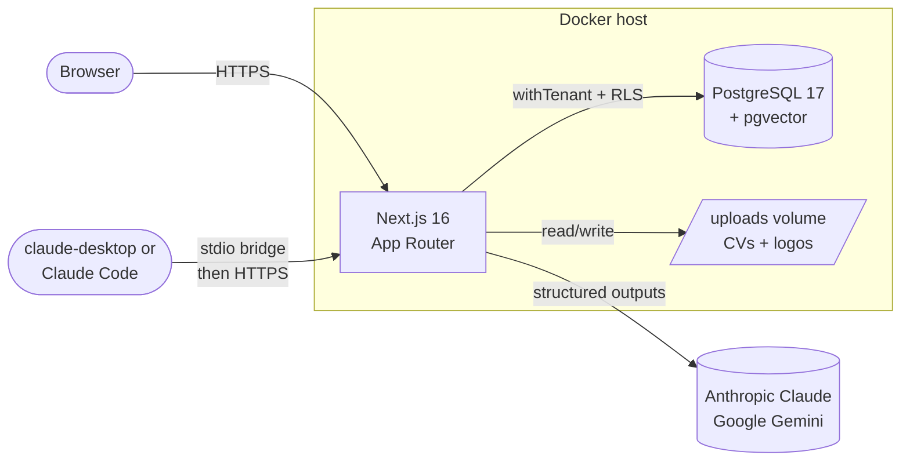
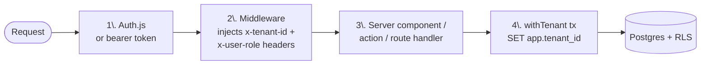

# System overview

_How SkillAI is wired together — the high-level boxes, the request lifecycle, and where AI fits in._

SkillAI is a single Next.js 16 application backed by a single PostgreSQL 17 database. Everything else — file uploads, AI scoring, MCP integration — is either an in-process module or a thin transport adapter. There is no message queue, no worker fleet, no auxiliary service.

The whole system runs on one Docker host for dev and small production deployments; on AWS EKS for larger ones (see [AWS deployment](../operations/aws-deploy.md)).

## The boxes

Five things deserve attention:

- **Next.js does everything serverside** — pages render as Server Components, mutations run as Server Actions, polling and exports run as API routes. No separate API tier.
- **Postgres is the only stateful service.** All entities (tenants, users, candidates, roles, scores, audit logs, AI usage, calendar tokens) live here.
- **pgvector ships in the same database image** (`pgvector/pgvector:pg17`). Embeddings live in `candidates.embedding` as a `vector(768)` column with an HNSW index. No separate vector store.
- **Uploads live on a Docker volume** at `/app/uploads`. Production deployments swap this for an S3-compatible store (Garage). Details on [File storage](./file-storage.md).
- **AI providers are the only external dependencies.** Anthropic Claude is the primary provider; Gemini is a per-tenant toggle. Both are called with structured-output schemas so responses never need defensive parsing.

## The request lifecycle

Every request — web UI, REST API, or MCP tool call — follows the same four-stage shape:

1. **Authenticate.** Web requests use Auth.js v5 JWTs stored in httpOnly cookies. API and MCP calls use bearer tokens (`skl_<env>_<24-base62>`) verified via argon2 in `src/lib/api/auth-middleware.ts`.
2. **Inject tenant + role.** Middleware reads the JWT or token, forwards `x-tenant-id`, `x-user-id`, and `x-user-role` headers to the handler. Server components and actions read these via `headers()`.
3. **Run the handler.** Server components fetch data; Server Actions mutate. Both validate input with Zod schemas before touching the database.
4. **Wrap every query in `withTenant`.** The helper in `src/db/index.ts:28` opens a transaction and calls `set_tenant_context()` so PostgreSQL Row-Level Security policies filter rows to the correct tenant. See [Multi-tenancy & RLS](./multi-tenancy-rls.md) for the full pattern.

Background work — AI scoring, interview pack generation, calendar sync diffing — runs via Next.js `after()`. There is no external queue.

## Multi-tenancy at 10 000 ft

One Postgres schema. Every table has `tenant_id UUID NOT NULL`. Every table enables RLS with a policy filtering on `current_setting('app.tenant_id', true)::uuid`. The `withTenant()` wrapper sets that session variable inside a transaction before any query runs.

This means it is architecturally impossible for application code to read across tenant boundaries, even if a query is written incorrectly. The full rationale lives in [DEC-003](../decisions/dec-003-row-level-security.md).

Hiring managers, recruiters, admins, and viewers all live in the same `users` table with a `role` column; role-based gates use the `requireRole()` helper. The `hiring_manager` rank sits between `viewer` and `recruiter` so existing `requireRole(_, 'recruiter')` guards continue to block managers without any call-site changes.

## AI scoring at 10 000 ft

When a CV is scored against a role:

1. **Parse** the uploaded PDF/DOCX/etc. to plain text. Helpers in `src/lib/cv/store.ts`.
2. **Insert** a `scores` row with `score_status = 'pending'`.
3. **Return** immediately. The UI shows a "Scoring..." state.
4. **Fan out** in `after()` to either `scoreCandidateWithClaude()` or `scoreCandidateWithGemini()` depending on the tenant's `default_ai_model` setting.
5. **Validate** the structured-output response against the `CandidateScoreSchema` Zod schema. Failures land as `score_status='failed'` rows with the error message.
6. **Update** the row to `score_status='complete'` with the four dimension scores, reasoning text, and the AI summary.
7. **Poll** — the UI polls `/api/scores/<id>/status` every three seconds until the row reports complete or failed.

Full detail on the pipeline, the structured-output schema, and the auto-match top-3 scoring loop lives in [AI scoring pipeline](./ai-scoring-pipeline.md).

## Where to next

### Multi-tenancy & RLS

The `withTenant()` wrapper, the RLS policy template, and why this beats schema-per-tenant. [Read more](./multi-tenancy-rls.md).

### AI scoring pipeline

End-to-end flow from CV upload to ranked list. Includes the structured-output schema and auto-match. [Read more](./ai-scoring-pipeline.md).

### File storage

Docker volume layout, the logo upload pattern, path-traversal defence. [Read more](./file-storage.md).

### Tech stack

Every chosen library with versions and a one-sentence "why". [Read more](./tech-stack.md).
